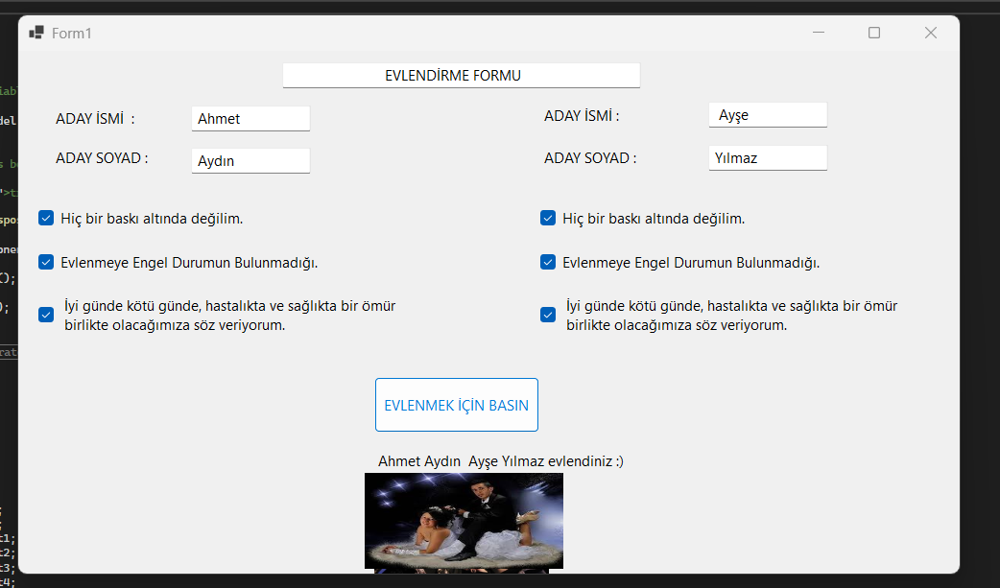

# 💌 form-of-love

Bu proje, **Görsel Programlama** dersi kapsamında "eğlencesine" yapılmış bir Windows Forms uygulamasıdır.  
Kullanıcılardan çeşitli bilgiler alarak bir **evlendirme formu** oluşturur.

---

## 🎯 Projenin Amacı

Amacımız: aşkı kodla bulmak!  
Aslında değil. Bu uygulama, görsel arayüz tasarımını öğrenirken aynı zamanda biraz eğlenmek için yapıldı. Form elemanları, veri doğrulama ve kullanıcı girişi konularında pratik yapmak isteyenler için basit ama sevimli bir örnek.

---

## 🛠️ Kullanılan Teknolojiler

- 👨‍💻 **C#**
- 🖼️ **Windows Forms**
- 🧱 **.NET Framework / Visual Studio**

---

## 📷 Ekran Görüntüsü

  

---

## 🚀 Nasıl Çalıştırılır?

1. Bu repoyu kendi bilgisayarına klonla:
   ```bash
   git clone https://github.com/Severustark/form-of-love.git

   --2023--
